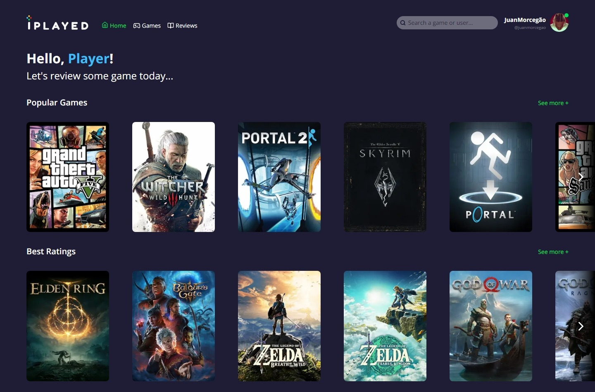

# IPlayed
<div align="center">

</div>

This is a [Next.js](https://nextjs.org/) project bootstrapped with [`create-next-app`](https://github.com/vercel/next.js/tree/canary/packages/create-next-app).

### This is a games library to you rate and organaze the games you have been playing developed by me to rate my favorite games, web link: <a href="#">IPlayed</a>

> Status: Developing!

</br>

## 💻 Running the app
```bash
# Install web & api dependencies
$ npm install
```
You need to configurate the .ENV document following the example in the project and create an account on the <a href="https://www.twitch.tv/">Twitch</a> website to use the <a href="https://api-docs.igdb.com/#account-creation">IGDB</a> API and on <a href="https://discord.com/developers/docs/topics/oauth2">Discord</a> website to use the OAUTH.

```bash
# Run the app
$ npm run dev
```
Open [http://localhost:3000](http://localhost:3000) with your browser to see the result.

## 🧪 Technologies:

+ Next JS
+ Node JS
+ TypeScript
+ Tailwind CSS
+ PostgreSQL